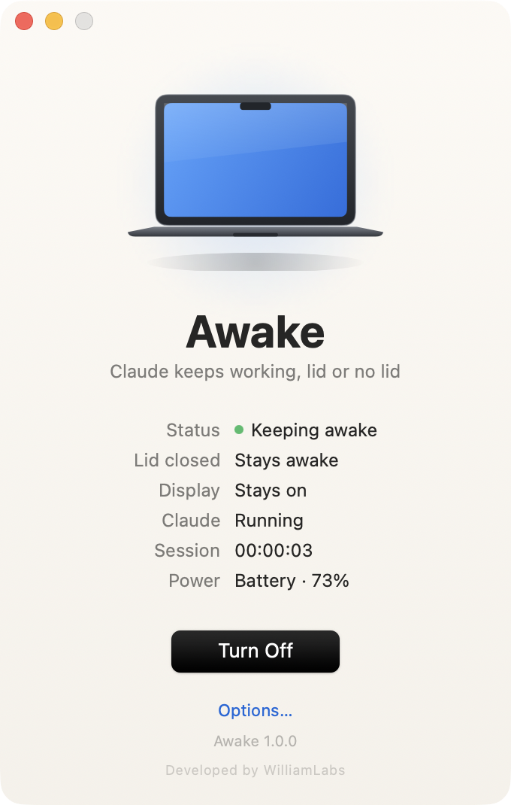
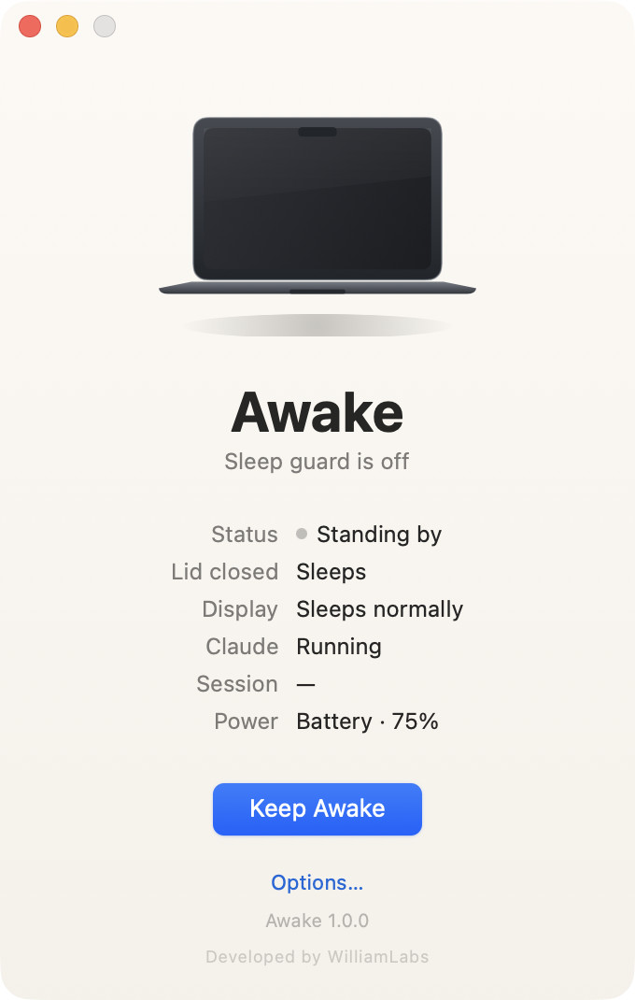
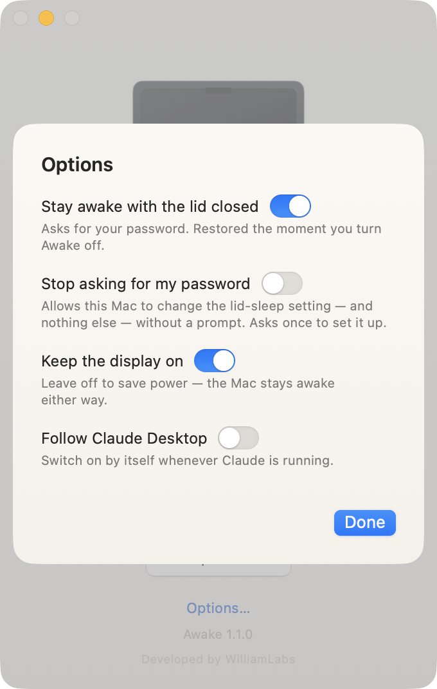
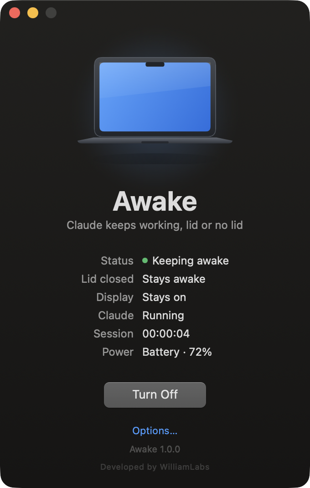

<h1 align="center">Awake</h1>

<p align="center">A 383 KB Mac app that keeps <b>Claude Desktop</b> working after you close the lid.</p>

<p align="center">
  
</p>

<p align="center">
  <a href="../../releases/latest"></a>
  
  
  
</p>

---

## Permissions & privacy — read this first

Awake asks for **one** thing, once per session, and nothing else.

| What | Why it is needed | What happens to it |
|---|---|---|
| **Your admin password**, in the standard macOS authorisation dialog | Closing the lid is an explicit hardware sleep request. No app can veto it — the only supported switch is `pmset -a disablesleep`, and that setting belongs to root. | Typed into **Apple's own dialog**, never into Awake. Awake never sees it, never stores it, never transmits it. macOS runs the one command and the dialog closes. |

**Not required, not requested:** Accessibility · Screen Recording · Full Disk Access · Automation over other apps · Camera · Microphone · Location · Contacts.

**Nothing leaves your Mac.** Awake contains no networking code of any kind — no telemetry, no analytics, no update check, no crash reporting. You can confirm it in one line:

```bash
otool -L /Applications/Awake.app/Contents/MacOS/Awake
```

**Everything it stores** — three on/off switches and the window position, in `~/Library/Preferences/com.williamlabs.awake.plist`. That is the whole footprint.

**It puts the setting back.** Turning Awake off, quitting it, or logging out restores normal sleep. If a crash or a cancelled prompt ever leaves it on, the window says so on the next launch and offers to fix it in one click.

> Only turn on *Stay awake with the lid closed* when it is doing real work. A Mac in a closed bag that cannot sleep gets warm.

---

## Why it exists

Claude Desktop keeps thinking, running tools and finishing long jobs — right up until the lid clicks shut and the Mac drops to sleep mid-task. Awake keeps the machine running so the work finishes, then hands sleep straight back.

| Row in the window | What it actually is |
|---|---|
| **Status** | An `IOPMAssertionCreateWithName` power assertion — the sanctioned way to hold off idle sleep. Released automatically if Awake ever dies. |
| **Lid closed** | The real `SleepDisabled` flag, read live from `IOPMrootDomain`. This is the part that survives the lid closing. |
| **Display** | An optional second assertion. Leave it off — the Mac stays awake with the screen dark, which uses far less power. |
| **Claude** | Whether `com.anthropic.claudefordesktop` is running. Turn on *Follow Claude Desktop* and Awake switches itself on and off with it. |

---

## Install

1. Download `Awake-1.0.0.dmg` from [Releases](../../releases/latest) and drag Awake to Applications.
2. First launch: **right-click → Open**. The app is ad-hoc signed, not notarised, so Gatekeeper asks once.

Prefer the terminal?

```bash
xattr -dr com.apple.quarantine /Applications/Awake.app
```

---

## Using it

Press **Keep Awake**. Close the lid. That is the app.

It lives in the menu bar too — closing the window leaves it running, and the bolt icon shows whether the guard is up.

<p align="center">
  
  &nbsp;&nbsp;
  
  &nbsp;&nbsp;
  
</p>

---

## Light on the machine

The app it is protecting is the one that should get the CPU, so Awake gets out of the way:

- **383 KB** universal binary, no frameworks bundled, no dependencies.
- Plain AppKit window hosting one SwiftUI view — no scene graph, no storyboard, no image assets. The MacBook is drawn as vectors in a single `Canvas` pass and never animates.
- **No polling.** Power changes arrive on an IOKit run-loop source, app launches and quits arrive as workspace notifications. The one timer only ticks the session clock, at 1 s while you are looking at the window and 30 s when you are not.

---

## Build from source

Command Line Tools are enough — no Xcode required.

```bash
./Scripts/build.sh --package
```

`dist/Awake.app` plus the `.zip` and `.dmg`. The icon is generated from vectors too, by `Scripts/make-icon.swift`.

---

## Restoring sleep by hand

Should you ever need it, this is the exact command Awake runs for you:

```bash
sudo pmset -a disablesleep 0
```

---

<p align="center"><sub>Developed by WilliamLabs · MIT</sub></p>
